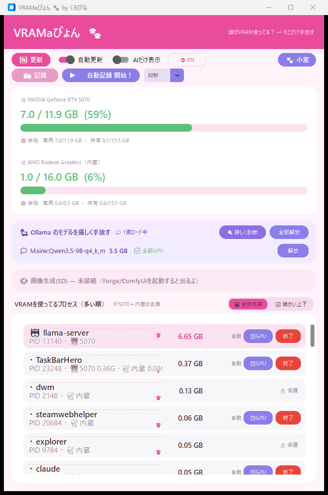
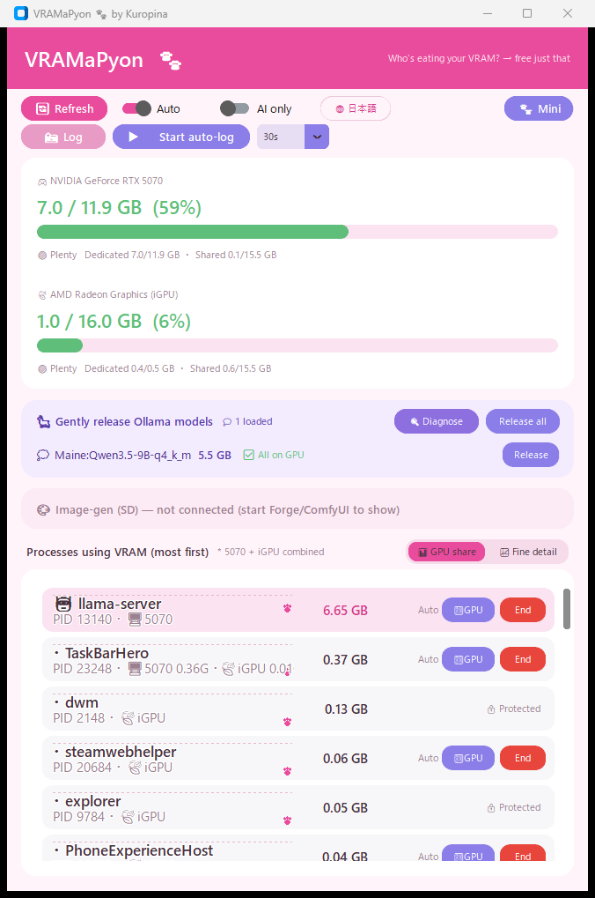
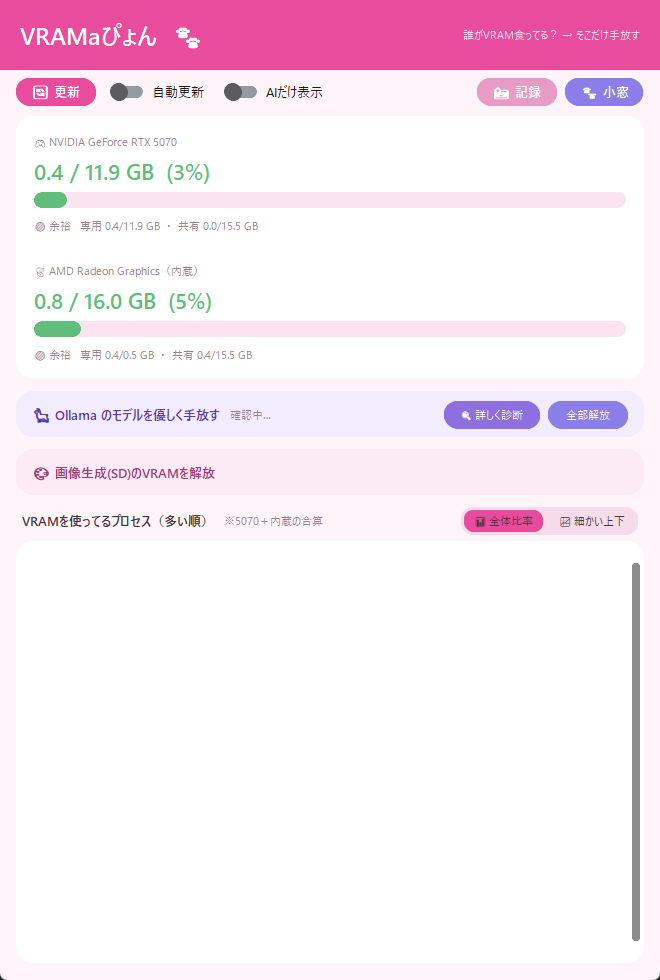

<div align="center">

# 🐾 VRAMaPyon

**Who's eating your VRAM? — free just that.**

A VRAM manager for AI workloads on Windows: see *per-process* VRAM (which `nvidia-smi` can't show), release just what you need, and watch the trend in a graph.


[日本語](README_JA.md) ｜ **English**

[📖 Manual (English)](MANUAL_EN.md) ｜ [📖 マニュアル（日本語）](MANUAL_JA.md)

</div>

---

## ✨ What is VRAMaPyon?

When you run local LLMs and image generation, VRAM fills up fast — and the usual question is *"wait, what's actually using it?"*

The catch: on **GeForce + Windows**, `nvidia-smi` reports per-process VRAM as `[N/A]` (a WDDM driver limitation). So you can *see* the total, but not *who* is using it.

**VRAMaPyon** reads Windows' own performance counter `\GPU Process Memory(*)\Dedicated Usage` to show **per-process VRAM**, tells you **which GPU** each process is actually running on, and lets you **release just what you choose** — Ollama models, image-gen VRAM, or a whole process — without nuking everything.

> By the way, the name is **VRAM** + *a* + **-pyon** (ぴょん, a bouncy little Japanese suffix — think *hop!*). Read it "VRAMa-pyon." Lovingly made in Japan 🐾

<div align="center">

</div>

## 🖥 Screen

Per-process VRAM (most first), two GPU gauges (your NVIDIA card + the integrated GPU), the Ollama / image-gen release panels, and a paw-print sparkline of each process's VRAM over time — all at a glance.

The UI speaks both Japanese and English (🌐 button).

<div align="center">

&nbsp;&nbsp;

</div>

## 🌟 Features

| Feature | Description |
|---|---|
| 👀 See per-process VRAM | Sorted high→low, AI apps tagged 🤖, with an "AI only" filter. Works even where `nvidia-smi` shows N/A |
| 🖥 Which GPU? | Each row shows the GPU it's actually on (`🖥5070` / `🍃iGPU`); split by GB when a process spans both |
| 🐾 Paw-print sparkline | Per-process VRAM trend right in the row — toggle **GPU share** vs **fine detail**, with state colors (🔥pinned / ▲rising / stable) |
| 📊 Two GPU gauges | Whole-memory usage for your NVIDIA card **and** the integrated GPU (dedicated / shared breakdown, 🟢🟡🟠🔴) |
| 🦙 Gently release Ollama | Sends `keep_alive:0` to drop a model from VRAM while keeping the server alive (instant comeback next chat) |
| 🎨 Release image-gen VRAM | Unload the checkpoint from **Forge** (`--api`) or **ComfyUI** in one click |
| ❌ End a process | With a confirm dialog — and 🔒 protection so you can't kill `dwm` / `explorer` / etc. |
| 🎛 Pick a GPU per app | Send non-AI apps to the iGPU and keep your NVIDIA card free for LLM/SD (Windows Graphics-settings level) |
| 🐾 Mini window | A frameless always-on-top corner widget with a gentle warning glow as VRAM fills |
| 📸 Logging + trend charts | Save a snapshot to Excel — auto-builds a **Trends** sheet with 3 line charts + in-cell data bars |
| ▶️ Auto-log | Sample every 15 / 30 / 60s into one file; the graph grows on its own |
| 🔍 Diagnosis tool | Launches the companion "Ollama diagnosis" GUI, with a VRAM-fit badge on each model |
| 🌐 JP / EN | The whole UI switches language on the fly |

## 💻 Requirements

| Item | Details |
|---|---|
| OS | Windows 10 / 11 |
| Python | 3.10+ |
| GPU | An NVIDIA GPU for the total gauge (`nvidia-smi`). The per-process list works with other GPUs too |
| Libraries | `customtkinter` (auto-installed on first run). `openpyxl` is auto-installed the first time you save a log |
| Optional | Ollama / Forge (`--api`) / ComfyUI — release buttons light up only when they're reachable |

## 🚀 Setup

```bash
# Start it
python VRAMaPyon.py

# Console only (print data without the GUI)
python VRAMaPyon.py --probe
```

On first launch it installs `customtkinter` automatically if it's missing.

## 🎛 Picking a GPU per app (free up your card for AI)

Each process row has a **🎛GPU** button → choose **🚀 RTX (high performance)** / **🍃 iGPU (power-saving)** / **🪟 Auto**. This writes the same setting as Windows' *Graphics settings* (`HKCU\…\DirectX\UserGpuPreferences`).

The idea: push browsers and GUI apps onto the **integrated GPU**, so your NVIDIA card's VRAM stays free for LLM / SD.

**Good to know**
- It only moves **rendering (D3D) VRAM**. **CUDA memory (LLM/SD) always stays on the NVIDIA card** and can't be moved this way.
- Takes effect **after the target app restarts**, and is set **per exe path**.
- Shell processes like `dwm` / `explorer` follow whichever GPU your display is plugged into, so this setting won't move them.

> 💡 **The real "all-in":** plug your monitor into the motherboard's video output (the iGPU). The whole desktop — `dwm` included — moves off the NVIDIA card, turning it into a display-less compute card for LLM/SD. Games can still target it via the 🎛GPU "RTX" option (hybrid-GPU behavior).

## 📊 Logging & trend graphs

Press **📸 Log** to save the current snapshot to an `.xlsx`. Each save rebuilds a **Trends** sheet (`推移グラフ`) with three line charts — total GPU VRAM, GPU usage %, and per-process VRAM — placed right at the top, plus in-cell data bars on the data sheet.

Want to watch it over a few minutes? Hit **▶️ Auto-log**, pick a file once, and it samples every 15 / 30 / 60 seconds into the same file so the lines grow on their own. The default filename is date-stamped, so a day's records collect into one file.

## 🐾 Mini window

Press **🐾 Mini** to shrink into a small frameless, always-on-top widget showing the live gauge. The border glows pink → amber → a soft pulsing red as VRAM fills, so you can keep an eye on it from the corner of your screen. Double-click to come back.

## 🔧 Troubleshooting

| Symptom | Check |
|---|---|
| The process list is empty | Try running as administrator (some processes' counters need it) |
| The Ollama / image-gen buttons are greyed out | That just means they aren't reachable yet — start Ollama / Forge (`--api`) / ComfyUI and they light up automatically |
| Auto-log stopped with an error | The log file is probably open in Excel — close it and start again |
| The graph looks empty | Open the **`推移グラフ` / Trends** tab (it opens there by default); a line needs at least two snapshots |
| More details | See the [📖 Manual](MANUAL_EN.md) |

## 🙏 Acknowledgments

- [CustomTkinter](https://customtkinter.tomschimansky.com/) — GUI framework
- [openpyxl](https://openpyxl.readthedocs.io/) — Excel charts & data bars
- [NVIDIA System Management Interface](https://developer.nvidia.com/system-management-interface) & Windows Performance Counters — the data behind the scenes
- [Ollama](https://ollama.com/) / [Forge](https://github.com/lllyasviel/stable-diffusion-webui-forge) / [ComfyUI](https://github.com/comfyanonymous/ComfyUI) — the tools VRAMaPyon helps you manage

## 📜 Terms of Use & Disclaimer

- The copyright of this software belongs to the author (All rights reserved).
- Personal use and tinkering on your own machine are welcome. **Please do not redistribute it or publish modified versions without permission** (if you'd like to, just ask!).
- Use at your own risk. The author assumes no responsibility for any damages arising from its use. Editing the registry / ending processes is done on your own responsibility.

---

<div align="center">

🐾 **VRAMaPyon** — keep an eye on your VRAM, free just what you need.

</div>
